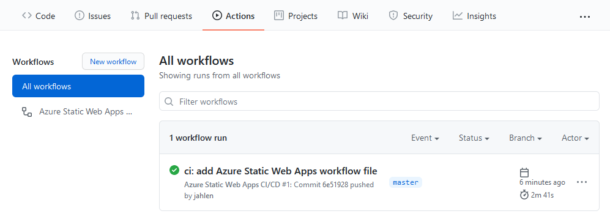
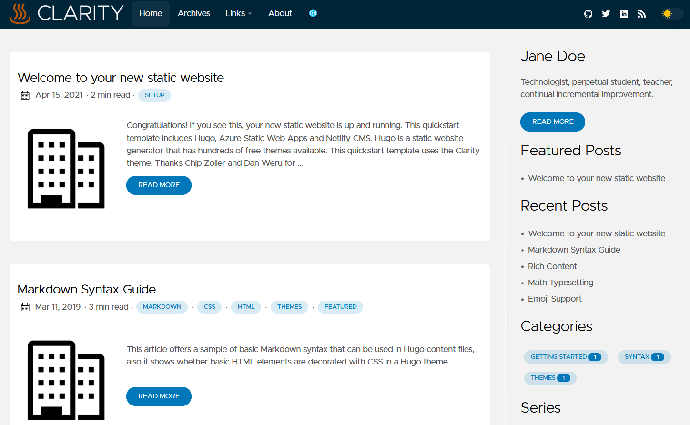
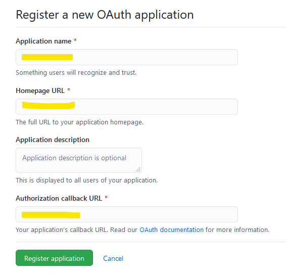
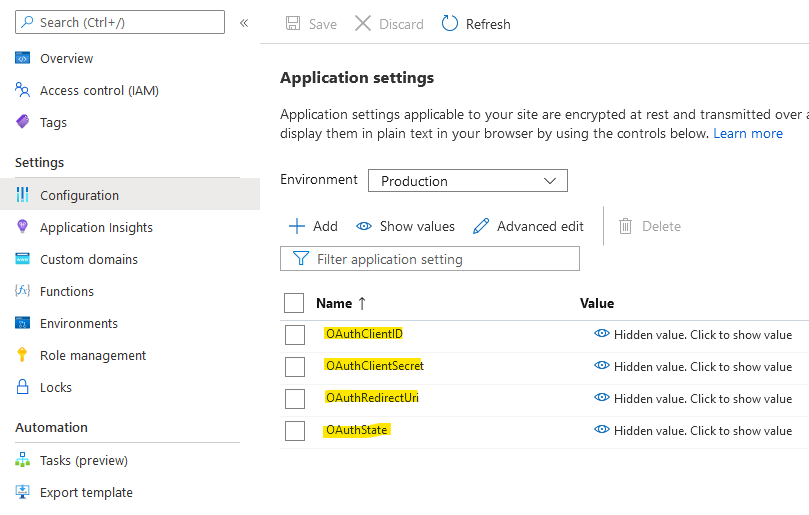

# Hugo / Azure Static Web Apps / Netlify CMS quickstart template

Create a static website with [Hugo](https://gohugo.io/), [Azure Static Web Apps](https://docs.microsoft.com/en-us/azure/static-web-apps/) and optionally [Netlify CMS](https://www.netlifycms.org/). For an example see [www.how2code.info](https://www.how2code.info).

* *Hugo* is a static website generator that has hundreds of free [themes](https://themes.gohugo.io/) available. This quickstart template uses the [Clarity](https://themes.gohugo.io/hugo-clarity/) theme. Thanks Chip Zoller and Dan Weru for your theme!
* *Azure Static Web Apps* is a feature-rich hosting service for static web apps. It offers custom domains, CDN, automatic certificates, API hosting, easy CI/CD setup, and many more benefits.
* *Netlify CMS* is a headless CMS (a content editor) that is compatible with most static website generators. It lives and stores content in your website GitHub repository. Setup is very easy.

Static websites ([Jamstack sites](https://www.jamstack.org)) have many benefits, including better performance, higher security and lower costs. Read [this article](https://www.how2code.info/en/blog/azure-static-web-apps-the-fast-and-secure-way-to-run-your-blog/) for an introduction to the Jamstack architecture.

# Instructions

## 1. Create your repository
Create your own copy of this repository. Visit [this link](https://github.com/jahlen/hugo-azure-static-webapp/generate) to create.

## 2. Create a Static Web App in the Azure Portal
In the [Azure Portal](https://portal.azure.com/), search for Static Web App and click Create. 

Sign in with your GitHub account. Replace the yellow marked fields below with your own values:


Enter the following locations:


Your Azure Static Web App should be created within a few minutes.

**Note: Your website will look like crap until you have edited the configuration files (step 5).**

## 3. Check your GitHub action

Azure should have created a GitHub action in your repository. Check that it exists and that it has executed successfully. Otherwise something went wrong during step 2.



## 4. (Optional) Add a custom domain in Azure

*Only if you already have a domain that you wish to use, for example www.mydomain.com*. 

In the Azure Portal / Static Web App, go to **Custom domains** under Settings and add it. Follow the instructions for configuring your DNS-server.

Wait a couple of minutes for your custom domain to be completely setup, including the HTTP certificate.

## 5. Edit configuration files in your repo

In your GitHub repository, edit the following files:

* app/config.toml
* app/config/_default/config.toml
* app/config/_default/params.toml

Make sure to point **baseurl** to your website address. This could either be your custom domain, or the website address you were given by Azure Static Web Apps.

## 6. Visit your website

Now visit your website! You should see something like this.



Note that the Admin-button at the bottom will not work until you have configured Netlify CMS.

## 7. Edit your website

See the [Hugo Clarity](https://github.com/chipzoller/hugo-clarity) documentation for instructions on how to customize your website.

You can edit the files under *app/content*. Instead of editing them manually, you can use Netlify CMS. There is an Admin-button in the page footer that will take you to Netlify CMS.

## 8. (Optional) Configure Netlify CMS

Netlify CMS depends on a backend API for authentication. This is handled by */api/OAuth.cs*, but it requires some configuration. If you wish to use Netlify CMS, you need to do these things:

1. Update the settings in *app/static/admin/config.yml*
2. Create a GitHub application
3. Configure your Azure Static Web App with the OAuth settings

### app/static/admin/config.yml

You will need to adjust the settings under *backend* and point them to your repository and domain.

### Create a GitHub application

Go to your GitHub [Developer settings](https://github.com/settings/developers). Click on New OAuth App.



* *Application name* can be anything you want
* *Homepage URL* can be anything you want
* *Authorization callback URL* must be something like https://www.yourwebsite.com/api/callback

After registering your app, click *Generate a new client secret*. Save a copy of your *Client ID* and *Client Secret* for use in the next step.

### Configure your Azure Static Web App with the OAuth settings

In the Azure Portal, you need to add these Application Settings to your Static Web App:



* *OAuthClientID* and *OAuthClientSecret* are the ones you previously received from GitHub when you created your GitHub application
* *OAuthRedirectUri* should be like https://www.yourwebsite.com/api/callback (same as you entered in GitHub)
* *OAuthState* should be just a long random string

Now try visiting https://www.yourwebsite.com/admin/ to open Netlify CMS.

## 9. (Optional) Setup local development environment

You can easily run and edit your website locally!

First [install Hugo](https://gohugo.io/getting-started/installing). 

Clone your GitHub repository locally. Either by using a tool like Visual Studio Code, or by command-line:

```
git clone https://github.com/yourusername/yourreponame.git
```

Open a command-prompt and go to the app directory of your local repository. Start the Hugo webserver:

```
hugo server -D
```

Hugo will tell you the local address of your website (usually http://localhost:1313).

Edit your website. Hugo will automatically trigger a rebuild of your website if any files change.

## Enjoy!!
