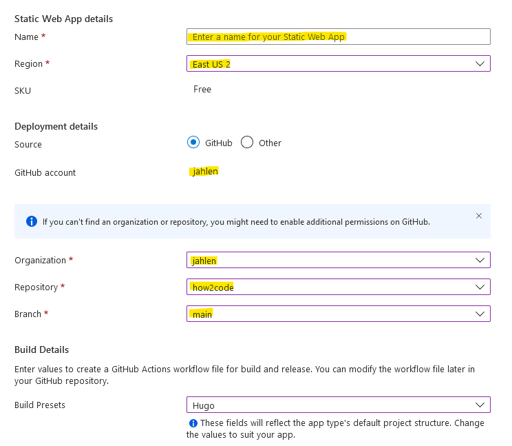

# Hugo / Netlify CMS / Azure Static Web App quickstart template

Create a static website based on [Hugo](https://gohugo.io/), [Netlify CMS](https://www.netlifycms.org/) and [Azure Static Web App](https://docs.microsoft.com/en-us/azure/static-web-apps/). For an example see [www.how2code.info](https://www.how2code.info).

> Static websites ([Jamstack sites](https://www.jamstack.org)) have many benefits, including better performance, higher security and lower costs. Read [this article](https://www.how2code.info/en/blog/azure-static-web-apps-the-fast-and-secure-way-to-run-your-blog/) for an introduction to the Jamstack architecture.

# Instructions

## 1. Create your repository
Create your own copy of this repository. Visit [this link](https://github.com/jahlen/hugo-azure-static-webapp-quickstart/generate) to create.

## 2. Create a Static Web App in the Azure Portal
In the [Azure Portal](https://portal.azure.com/), search for Static Web App and click Create. 

Sign in with your GitHub account. Replace the yellow marked fields below with your own:

Enter the following locations:

Your Azure Static Web App should be created within a few minutes.

## 3. Check your GitHub action

Azure should have created a GitHub action in your repository. It should be found under *.github/workflows*. Check that it exists. Otherwise something went wrong during step 2.

## 4. (Optional) Add a custom domain in Azure

*Only if you already have a domain that you wish to use, for example www.mydomain.com*. 

In the Azure Portal / Static Web App, go to **Custom domains** under Settings and add it. Follow the instructions for configuring your DNS-server.

Wait a couple of minutes for your custom domain to be completely setup, including the HTTP certificate.

## 5. Edit configuration files in your repo

In your GitHub repository, edit the following files:

* app/config.toml
* app/config/_default/config.toml
* app/config/_default/params.toml

Make sure to point **baseurl** to your website address. This could either be your custom domain, or the website address you were given by Azure Static Web Apps.

## 6. Visit your website

Now visit your website! Try clicking around on the website to check that it works. If not, check out the configuration files from step 5.

## 7. Configure Netlify CMS

There is an Edit-button at the bottom of your website. It takes you to Netlify CMS.

You will need to setup GitHub authentication for Netlify CMS to work.
